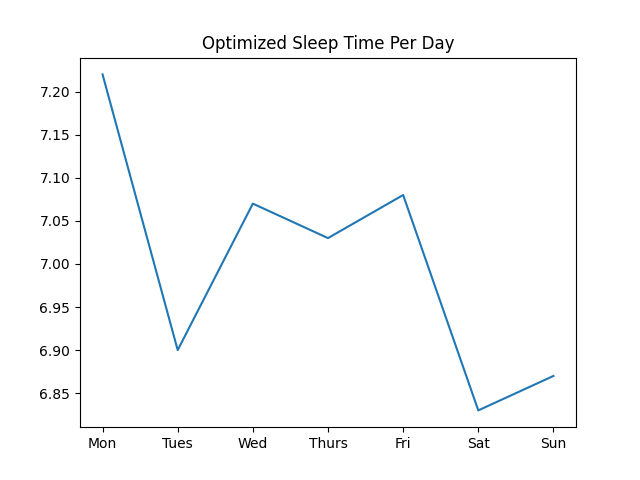

# Project 3: Optimizing Sleep
College students are constantly sleep-deprived. Deadlines after deadlines, students compromise on sleep. For this project, I optimize my weekly sleep time using linear programming.

# Data Collection
Based on data obtained from the 'Health' app in my phone, I collected the [average sleep](./sleep_data.xlsx) in the past four months.
The scope has been decided for one semester as other semesters have different schedules and it would be hard to average sleep time.

Taking the weekly average sleep time of 13 weeks, I derived that my weekly average sleep is 6 hours and 16 minutes. 
The average daily sleep for the days are as follows:

H:M | Mon | Tues | Wed | Thurs | Fri | Sat | Sun
-- | -- | -- | -- | -- | -- | -- | --
Average Sleep time | 7:13 | 6:54| 7:04 | 7:02 | 7:05| 6:50 | 7:02

Really, not that interesting. This is because there were factors that influenced the regularity of sleep this semester that did not allow for an interesting average to tell a story about the sleep cycle. 

# Formulation of the LP

Objective Function:

The objective function is to maximize weekly sleep time based on the decision variables are the sleep time of Monday through Sunday. 
```(python)
Max z = x1 + x2 + x3 + x4 + x5 + x6 + x7
```

Constraints:
1. The first part of the constraints are derived from the data collected: we cannot sleep more than the data's average per day, as it would have an effect on the amount of work getting done throughout the day in lieu of assignments.

2. Next, we cannot sleep more than 20 hours per weekend because catching up on sleep is not a healthy sleep habit and we prefer to sleep evenly throughout the week.
3. Finally, the total hours of sleep in a week must be less than 49 hours per week (Oversleeping is not what we want.)

# Results

The optimized results are shown below. 

Time in Decimals | Mon | Tues | Wed | Thurs | Fri | Sat | Sun
-- | -- | -- | -- | -- | -- | -- | --
Optimized Sleep Time | 7.22| 6.9 | 7.07 | 7.03 | 7.08 | 6.83 | 6.87

This is visualized below.


I can sleep the most on Mondays. I can sleep the least on Saturdays.

# Assumptions and Limitations
The main assumption of the data is that the time collected is correct. However, the way that the app data collects the wake up time is when the alarm goes off. Many times, I snooze and go back to sleep. Therefore, the collection may not reflect the actual duration of my sleep.